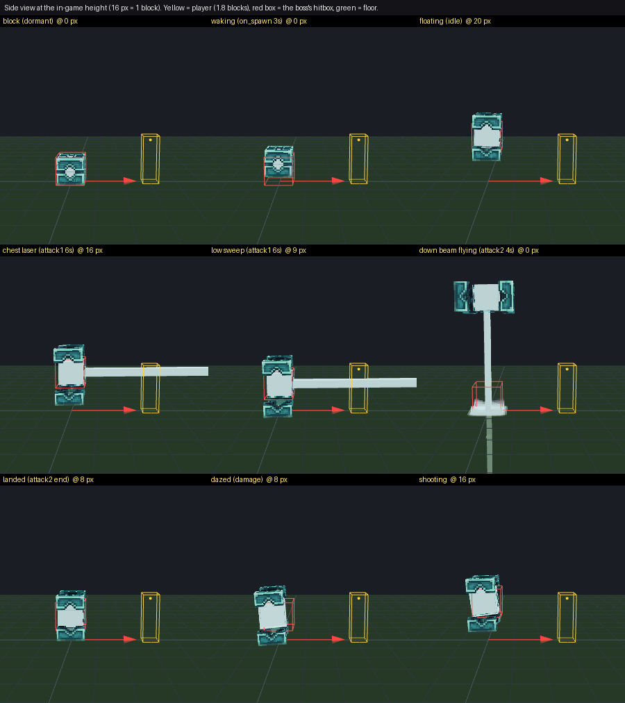

# FischVogel's End Boss

A MythicMobs + ModelEngine + Nexo boss: a soul trapped in a block.

**Download:** [`Fischvogel's End Boss.zip`](Fischvogel's%20End%20Boss.zip) - drag the contents of its
`plugins` folder into the server's `plugins` folder. Everything else is in the
[Installation Guide](Fischvogel's%20End%20Boss/Installation%20Guide.txt).

## Layout

| Path | What it is |
|---|---|
| `Fischvogel's End Boss/` | Exactly what goes into the zip - the source of truth. |
| `Fischvogel's End Boss/plugins/MythicMobs/packs/fv_endboss/` | Mobs and skills: `core` (block, wake-up, loop, phases, damage rules, height, death), `laser`, `flight`, `shooting`, `fx` (every sound / particle cue). |
| `Fischvogel's End Boss/plugins/ModelEngine/blueprints/` | The two blueprints, generated from the originals by `tools/convert_models.py`. |
| `Fischvogel's End Boss/plugins/Nexo/pack/assets/fv_endboss/` | Custom sounds (`sounds.json`, `.ogg`, subtitles), generated by `tools/make_sounds.py`. |
| `Fischvogel's End Boss/Source Files/` | The original `.bbmodel` files as delivered, plus the converted models in Blockbench 5 format. |
| `tools/` | Build, conversion, sound synthesis, static checker and fight simulator. |

## Where it sits in the game



Every height in the skills was measured against the blueprint (`tools/model_lowest.json`,
the lowest point of the cube and frame per animation tick) so the frame never sinks into
the floor; the fight simulator checks this every tick.

## Tools

```sh
python3 tools/build.py              # convert + verify models, check, write the zip
python3 tools/build.py --sounds     # ... and re-synthesise the sounds first
python3 tools/build.py --sim 20     # ... and play 20 simulated fights per scenario
```

* `convert_models.py` / `verify_models.py` - functional-only blueprint conversion (bakes
  `math.random()` per tick, hides the z-fighting eye cubes in `idle`, adds the `dormant`
  pose, sets `override`, writes Blockbench's legacy 4.10 format) and its proof that
  geometry, textures and every authored keyframe are unchanged.
* `make_sounds.py` - deterministic formant / texture synthesis of the 18 custom sounds.
* `check_pack.py` - every skill reference, animation, sound and particle name (against the
  1.21.1, 1.21.4 and 26.1 game data in `tools/vanilla_data`, from
  [PrismarineJS/minecraft-data](https://github.com/PrismarineJS/minecraft-data)), variable
  reads vs. writes, math and bracket syntax.
* `simulate_fight.py` - interprets the real skill files tick by tick with scripted players
  and checks the fight's invariants (one attack chain at a time, no animation gaps, exact
  heights, phases, death / reset / chunk-unload flows) under both possible skill-variable
  semantics.

Python 3.10+ with `numpy`, `scipy`, `soundfile` and `pyyaml`; `ffmpeg` with libvorbis for
the sounds.
